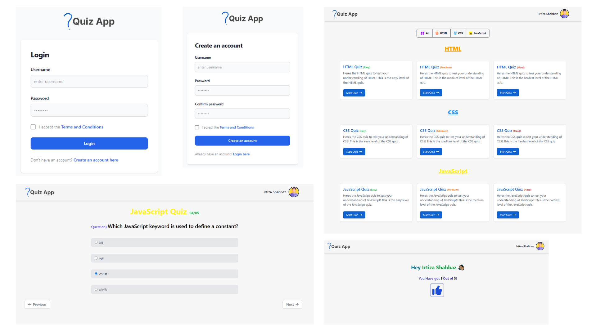

# Quiz Web App

This project is a Quiz Web Application built using **TailwindCSS** and **JavaScript**. The app includes a **Sign Up** and **Login** feature, where user data is stored securely in **localStorage** instead of a database.

## Features:
- **User Authentication**: Sign up and log in functionality with data stored in the browser's localStorage.
- **Home Page**: A simple homepage with quiz categories on HTML, CSS, and JavaScript. Each category offers quizzes with three difficulty levels: **Easy**, **Medium**, and **Hard**.
- **Interactive Quiz**: 
  - Users can navigate through quiz questions using **Next** and **Previous** buttons.
  - After completing the quiz, the **Next** button transforms into a **Submit** button, which, when clicked, shows the user's **name** and **score** in a clean, user-friendly interface.

## How to Run:
1. Clone this repository.
2. Open `index.html` in your browser to run the app locally.

## Technologies Used:
- **TailwindCSS** for responsive design and styling.
- **JavaScript** for quiz logic and user interaction.
- **localStorage** for saving user login and quiz data.

Enjoy the quiz!

---

### Note:
To display the preview image, replace the `path/to/your/preview-image.png` with the actual file path of your preview image in the repository.

